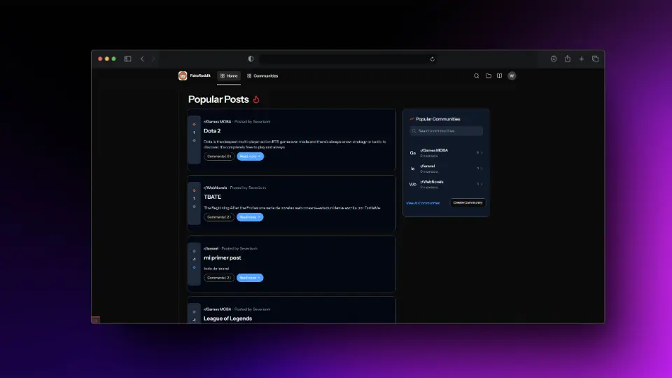

# 🚀 Foro en Laravel 12 con Inertia.js  

Un foro estilo Reddit construido con **Laravel 12** en el backend e **Inertia.js + React** en el frontend.  

<p align="center">
  
</p>

## 📌 Tabla de Contenidos

- [🚀 Foro en Laravel 12 con Inertia.js](#-foro-en-laravel-12-con-inertiajs)
  - [📌 Tabla de Contenidos](#-tabla-de-contenidos)
  - [✅ Requisitos Previos](#-requisitos-previos)
  - [⚡ Instalación](#-instalación)
  - [⚙️ Configuración](#️-configuración)
  - [🚀 Uso](#-uso)
    - [🌎 URL Base](#-url-base)
  - [✨ Funcionalidades](#-funcionalidades)
  - [🛠 Tecnologías Usadas](#-tecnologías-usadas)
  - [📚 Recursos](#-recursos)
  - [📚 Recursos](#-recursos-1)
    - [Laravel](#laravel)
    - [Inertia.js y React](#inertiajs-y-react)
    - [Herramientas y Recursos Útiles](#herramientas-y-recursos-útiles)
  - [📜 Licencia](#-licencia)

---

## ✅ Requisitos Previos

- **Backend:** Laravel 12, PHP 8.4  
- **Frontend:** Inertia.js, React, Tailwind CSS  
- **Base de Datos:** SQLite (por defecto) o MySQL/PostgreSQL según configuración  

---

## ⚡ Instalación

1. Clona este repositorio:
   ```bash
   git clone https://github.com/WillJkdev/laravel-simple-reddit-clone.git
   cd simple-laravel-reddit-clone
   ```
---

## ⚙️ Configuración

1. Crea el archivo `.env` en la raíz del proyecto. Puedes usar el archivo `.env.example` como referencia.
   ```bash
   cp .env.example .env
   ```
2. Genera la clave de la aplicación y ejecuta las migraciones con datos de prueba:
   ```bash
   php artisan key:generate
   php artisan migrate --seed
   ```
---

## 🚀 Uso

1. Para iniciar el servidor de desarrollo, ejecuta:
   ```bash
   composer run dev
   ```
2. Alternativamente puedes iniciar el servidor de desarrollo con los comandoos:
   ```bash
   php artisan serve
   npm run dev
   ```
---

### 🌎 URL Base

```
http://127.0.0.1:8000/
```

---
## ✨ Funcionalidades

- 📌 Creación y gestión de posts y comunidades
- 👍 Sistema de votos (upvote/downvote)
- 💬 Paginación y comentarios anidados
- 🎨 Diseño responsive con Tailwind

## 🛠 Tecnologías Usadas

- Laravel
- PHP
- SQLite
- Inertia.js
- React
- Tailwind CSS

## 📚 Recursos

## 📚 Recursos

### Laravel
- [Laravel Docs](https://laravel.com/docs) – Documentación oficial  
- [Laravel Debugbar](https://github.com/barryvdh/laravel-debugbar) – Herramienta para depuración  
- [Laravel Pint](https://github.com/laravel/pint) – Formateador de código automático  

### Inertia.js y React
- [Inertia.js Docs](https://inertiajs.com/) – Documentación oficial  
- [React Docs](https://react.dev/) – Documentación de React  
- [Tailwind CSS](https://tailwindcss.com/docs/) – Documentación de Tailwind  

### Herramientas y Recursos Útiles
- [Composer](https://getcomposer.org/doc/) – Documentación oficial  
- [PHP: The Right Way](https://phptherightway.com/) – Buenas prácticas en PHP  
- [MySQL Reference Manual](https://dev.mysql.com/doc/) – Documentación de MySQL  


## 📜 Licencia

Este proyecto está licenciado bajo la [Licencia MIT](LICENSE).
